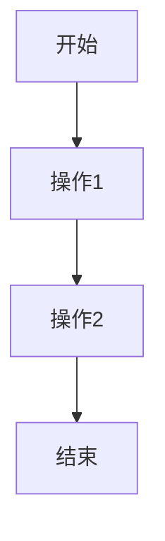

# Ollama Web Interface

<div align="center">
  
</div>

一个基于 Ollama API 的 Web 界面，支持模型选择、连续对话和参数配置。

<div align="center">

[](LICENSE)
[](package.json)
[](https://github.com/ollama/ollama)

</div>

## 功能特性

- 🤖 多模型支持 - 自动获取并展示所有可用的 Ollama 模型
- 💬 连续对话 - 支持上下文关联的多轮对话
- ⚙️ 参数配置 - 可调节 Temperature 和 Max Tokens 参数
- 🌐 API 配置 - 支持自定义 Ollama API 地址
- 📝 Markdown 渲染 - 完整支持 Markdown 语法渲染
- 📊 流程图支持 - 支持 Mermaid.js 流程图渲染
- 📁 会话管理 - 多标签页会话管理，支持创建、切换、重命名和删除
- 📱 响应式设计 - 适配桌面端和移动端
- 🔧 错误处理 - 完善的错误提示和解决方案建议
- 🌍 国际化 - 中文界面，符合中文用户习惯

## 快速开始

### 环境要求

- Node.js (推荐 v16+)
- Ollama 服务 (需要先安装并运行)

### 安装步骤

1. 克隆项目到本地:
```bash
git clone https://github.com/axfinn/ollamaWeb.git
cd ollamaWeb
```

2. 安装依赖:
```bash
npm install
```

3. 启动开发服务器:
```bash
npm run dev
```

4. 在浏览器中打开 `http://localhost:5173` 即可使用

### 构建部署

构建生产版本:
```bash
npm run build
```

预览构建结果:
```bash
npm run serve
```

## 使用说明

### 基础使用

1. 确保 Ollama 服务正在运行
2. 在页面顶部选择一个模型
3. 在输入框中输入问题或指令
4. 点击发送或按 Enter 键发送消息
5. 等待模型回复

### 参数配置

- **Temperature**: 控制回复的随机性，值越高回复越随机
- **Max Tokens**: 控制回复的最大长度

### API 配置

1. 在侧边栏的 API 配置区域输入 Ollama 服务地址
2. 点击保存按钮保存配置
3. 刷新页面使配置生效

### 会话管理

- 点击 "+" 按钮创建新会话
- 点击标签页切换会话
- 右键标签页可重命名会话
- 会话数据自动保存在浏览器中

### Markdown 和流程图支持

本项目支持完整的 Markdown 语法渲染，包括：

- 标题、段落、列表
- 链接、图片
- 代码块和行内代码
- 引用块
- 表格

此外，还支持使用 Mermaid.js 渲染流程图、时序图等图表。使用方法如下：

`````

````

支持的 Mermaid 图表类型包括：
- 流程图 (Flowchart)
- 时序图 (Sequence Diagram)
- 甘特图 (Gantt)
- 类图 (Class Diagram)
- 状态图 (State Diagram)
- 饼图 (Pie Chart)
- git图 (Git Graph)

## 环境变量配置

项目支持通过环境变量配置默认 API 地址：

```bash
# 复制示例配置文件
cp .env.example .env
```

在 `.env` 文件中配置:

```bash
VITE_OLLAMA_HOST=http://localhost:11434
```

## 故障排除

### 常见问题

1. **连接被拒绝**
   - 确保 Ollama 服务正在运行
   - 检查 API 地址是否正确
   - 检查防火墙设置

2. **跨域问题 (CORS)**
   - 配置 Ollama 服务允许 CORS
   - 或使用代理方式访问

3. **模型加载失败**
   - 检查 Ollama 是否正常安装
   - 确认至少有一个模型已拉取

### 错误信息说明

- **连接错误**: 无法连接到 Ollama 服务
- **CORS 错误**: 跨域访问被阻止
- **404 错误**: API 路径未找到

## 开发指南

### 项目结构

```
ollamaWeb/
├── src/
│   ├── components/     # 组件
│   ├── utils/          # 工具类
│   ├── styles/         # 样式文件
│   └── main.js         # 入口文件
├── public/             # 静态资源
├── dist/               # 构建输出
└── vite.config.js      # 构建配置
```

### 技术栈

- [Vite](https://vitejs.dev/) - 前端构建工具
- [Marked.js](https://marked.js.org/) - Markdown 解析
- [Mermaid.js](https://mermaid-js.github.io/) - 图表渲染
- Vanilla JavaScript - 无框架实现

### 开发规范

- 遵循 [前端编码风格一致性要求](../aiPrompts/prompts/frontend_development.md)
- 使用语义化 HTML 和 CSS
- 保持良好的代码注释

## 贡献指南

欢迎提交 Issue 和 Pull Request 来帮助改进项目。

### 贡献步骤

1. Fork 项目
2. 创建功能分支 (`git checkout -b feature/AmazingFeature`)
3. 提交更改 (`git commit -m 'Add some AmazingFeature'`)
4. 推送到分支 (`git push origin feature/AmazingFeature`)
5. 开启 Pull Request

## 更新日志

详细更新内容请查看 [CHANGELOG.md](CHANGELOG.md)

## 许可证

本项目采用 MIT 许可证，详情请查看 [LICENSE](LICENSE) 文件。

## 联系方式

- 项目地址: [https://github.com/axfinn/ollamaWeb](https://github.com/axfinn/ollamaWeb)
- 问题反馈: [Issues](https://github.com/axfinn/ollamaWeb/issues)

## 请作者喝杯咖啡☕

如果您觉得本项目对您有帮助，欢迎请作者喝杯咖啡😄：

<table>
  <tr>
    <td align="center">
      
      <p>微信赞赏码</p>
    </td>
    <td align="center">
      
      <p>支付宝收款码</p>
    </td>
  </tr>
</table>

---

<div align="center">
  Made with ❤️ by <a href="https://github.com/axfinn">axfinn</a>
</div>